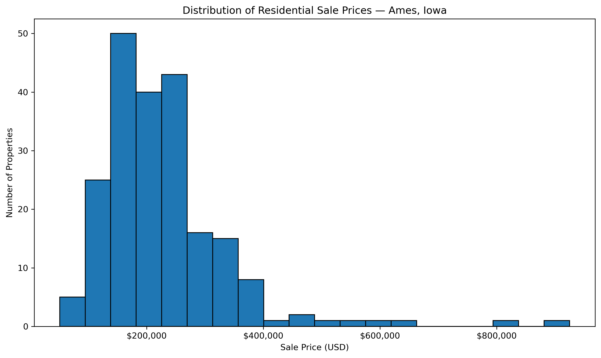
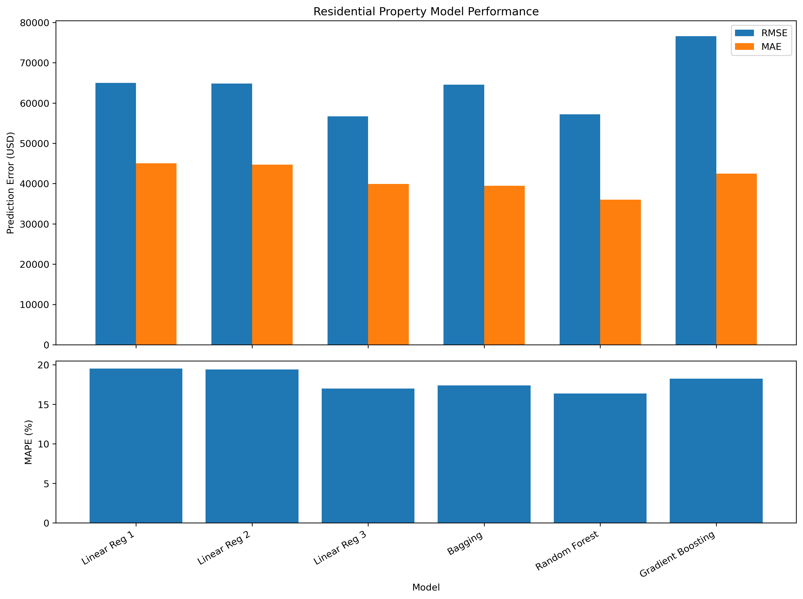
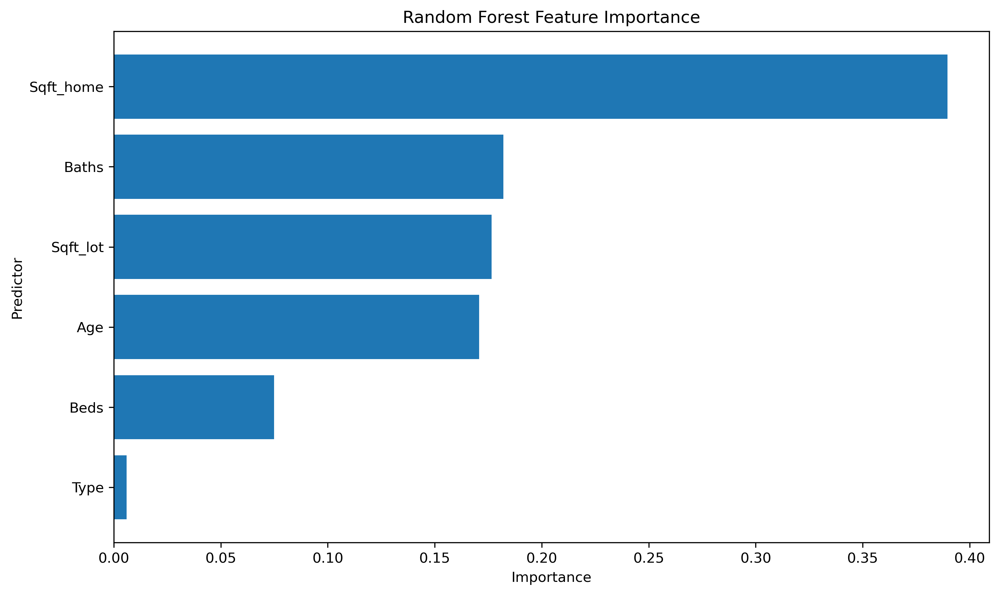

# Residential Property Value Prediction

## Comparing Linear Regression and Ensemble Tree Models with Python

This project examines residential property valuation using statistical regression and ensemble machine-learning methods. The analysis compares interpretable linear regression models with Bagging, Random Forest, and Gradient Boosting approaches to evaluate how effectively property characteristics can predict residential sale prices.

The project originated as coursework for **ADTA 4230 — Data Analytics and Computational Statistics 2** at the University of North Texas in Fall 2025.

This repository preserves a reconstructed and validated version of the original analysis for reproducibility, technical review, and portfolio presentation.

---

## Project Objective

The analysis addresses three primary questions:

1. How accurately can residential property characteristics predict sale price?
2. Which property attributes contribute most strongly to predicted value?
3. What trade-offs exist between interpretable linear models and nonlinear ensemble methods?

The target variable is:

- `Sale_amount`

The primary predictors used in the final modeling workflow are:

- `Beds`
- `Baths`
- `Sqft_home`
- `Sqft_lot`
- `Type`
- `Age`

---

## Dataset

The source workbook contains residential property transactions from multiple U.S. college-town markets.

The original course project narrowed the analysis to properties associated with **Iowa State University in Ames, Iowa**, producing a modeling dataset of **211 residential transactions**.

This repository intentionally preserves that original project scope.

A broader multi-market analysis using the complete source dataset is reserved as a potential future extension rather than being incorporated into the reconstructed coursework.

---

## Data Preparation

The original workflow was reconstructed and validated using the following process:

1. Load the `House_Price` worksheet from the source Excel workbook.
2. Filter records to Iowa State University / Ames, Iowa.
3. Convert property `Type` into a binary indicator:
   - Single Family = 1
   - Other property types = 0
4. Derive property `Age` from `Build_year`.
5. Remove fields that function as identifiers, constants, or redundant variables.
6. Retain the final predictor set for modeling.
7. Evaluate skew in the target and predictor distributions.
8. Apply logarithmic transformations in the third regression specification.

---

## Modeling Approach

### Linear Regression

Three Ordinary Least Squares regression models were evaluated.

**Model 1**

```text
Sale_amount ~ Beds + Baths + Sqft_home + Sqft_lot + Type + Age
```

**Model 2**

```text
Sale_amount ~ Baths + Sqft_home + Sqft_lot + Age
```

**Model 3**

```text
log(Sale_amount) ~ Baths + log(Sqft_home) + log(Sqft_lot) + Age
```

Model 3 introduced logarithmic transformations to better account for the right-skewed sale-price distribution.

### Ensemble Tree Models

Three ensemble approaches were also evaluated:

- Bagging-style tree ensemble
- Random Forest
- Gradient Boosting

Hyperparameter tuning was performed using `GridSearchCV` with **10-fold cross-validation** and Root Mean Squared Error as the optimization criterion.

A 70/30 train-test split was used for ensemble-model evaluation.

---

## Model Performance

| Model | RMSE | MAE | MAPE |
| --- | ---: | ---: | ---: |
| Linear Regression 1 | $65,029.86 | $45,056.80 | 19.51% |
| Linear Regression 2 | $64,834.34 | $44,709.81 | 19.42% |
| Linear Regression 3 | **$56,677.50** | $39,895.53 | 16.98% |
| Bagging | $64,555.79 | $39,467.93 | 17.40% |
| Random Forest | $57,218.84 | **$36,001.77** | **16.37%** |
| Gradient Boosting | $76,603.79 | $42,463.16 | 18.23% |

No single model dominated every evaluation metric.

- **Linear Regression Model 3 produced the lowest RMSE.**
- **Random Forest produced the lowest MAE and MAPE.**

This illustrates an important model-selection consideration: the preferred model depends on the business objective and the type of prediction error considered most important.

---

## Portfolio Visualizations

### Sale Price Distribution



The sale-price distribution is strongly right-skewed, which helped motivate the logarithmic transformations evaluated in Regression Model 3.

### Model Performance Comparison



Regression Model 3 produced the lowest RMSE, while Random Forest produced the strongest MAE and MAPE results.

### Random Forest Feature Importance



Home square footage was the dominant predictor within the Random Forest model. Bathrooms, lot size, and property age also contributed meaningfully to prediction.

---

## Key Findings

- `Sqft_home` was the strongest predictor across the ensemble-tree analysis.
- Bathrooms, lot size, and property age also contributed to predicted value.
- Log transformation substantially improved the strongest linear-regression specification.
- Random Forest achieved the lowest average absolute and percentage prediction error.
- Linear Regression Model 3 remained competitive while offering greater interpretability.
- More complex ensemble methods did not automatically produce better predictive performance.

---

## Limitations

Several limitations should be considered when interpreting the results.

### Geographic Scope

Although the source workbook contains data from multiple college-town markets, the original analysis was limited to **211 observations from Ames, Iowa**.

The results should therefore not be interpreted as a nationally generalizable residential valuation model.

### Sample Size

The relatively small modeling dataset limits the amount of variation available for model training and validation.

### Property-Type Simplification

Property type was reduced to a binary Single Family / Non-Single Family indicator. This improves modeling simplicity but removes distinctions between other property categories.

### Regression Assumptions

The regression models remain subject to assumptions associated with linear modeling, including linearity and potential multicollinearity.

### Interpretability

Ensemble models can capture nonlinear relationships but are less directly interpretable than a conventional regression equation.

---

## Repository Structure

```text
residential-property-value-prediction/
│
├── images/
│   └── portfolio/
│       ├── model_performance_comparison.png
│       ├── random_forest_feature_importance.png
│       └── sale_price_distribution.png
│
├── notebooks/
│   └── reconstruction/
│       └── residential_property_value_prediction_reconstruction.ipynb
│
├── .gitignore
├── README.md
└── requirements.txt
```

Original coursework, source data, and supporting evidence are retained locally and are intentionally excluded from the public repository.

---

## Reconstruction and Validation

The reconstruction notebook preserves the original analytical methodology while improving portability and reproducibility.

Changes made during reconstruction include:

- replacing machine-specific file paths with repository-relative paths;
- resolving Windows multiprocessing issues during `GridSearchCV`;
- validating the complete notebook from a clean kernel;
- regenerating selected visualizations for portfolio presentation.

The underlying modeling methodology and original analytical scope were not expanded during this reconstruction.

---

## Reproducibility

The reconstruction notebook preserves the original analytical workflow and has been validated using a complete **Restart & Run All** execution from a clean kernel.

Install the project dependencies with:

```bash
pip install -r requirements.txt
```

### Data Availability

The original course-provided workbook is retained locally and is not redistributed through this public repository.

To execute the notebook with the original source data, the workbook must be placed at:

```text
data/raw/Appendix_A_data.xlsx
```

The published notebook contains the validated analytical workflow, code, and executed outputs so the analysis can be reviewed directly through GitHub without requiring the source workbook.

---

## Technologies

- Python
- Jupyter Notebook
- pandas
- NumPy
- Matplotlib
- seaborn
- statsmodels
- scikit-learn
- GridSearchCV
- Microsoft Excel

---

## Skills Demonstrated

- Data Cleaning
- Data Preparation
- Exploratory Data Analysis
- Feature Engineering
- Statistical Modeling
- Linear Regression
- Ensemble Learning
- Random Forest
- Gradient Boosting
- Cross-Validation
- Hyperparameter Tuning
- Model Evaluation
- Feature Importance Analysis
- Data Visualization
- Analytical Documentation
- Reproducible Analysis

---

## Project Provenance

This analysis was originally completed as a **group academic project** for ADTA 4230 at the University of North Texas.

The repository reconstruction, reproducibility validation, documentation improvements, and portfolio presentation were completed subsequently as part of the Portfolio Project & Analytics Development initiative.

The reconstruction is intended to preserve and document the original analytical work rather than represent the original group project as an independently authored production model.

---

## Future Development

A potential future extension will evaluate the full multi-market dataset rather than limiting the analysis to Ames, Iowa.

Potential areas of investigation include:

- pooled models across multiple college-town markets;
- market-specific model performance;
- predictor stability across geographic markets;
- local versus pooled modeling strategies;
- market-aware validation;
- holding out entire towns to evaluate model generalizability.

This extension is intentionally separate from the reconstructed original project and is reserved for a future release.
